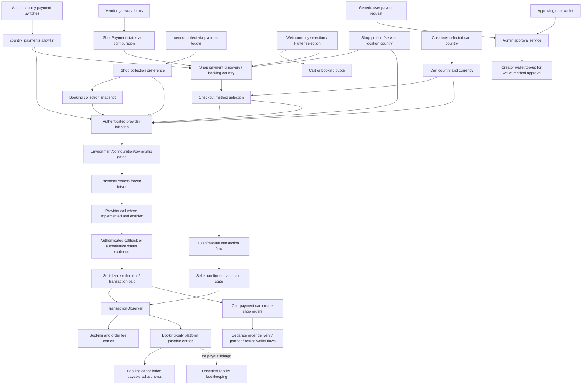
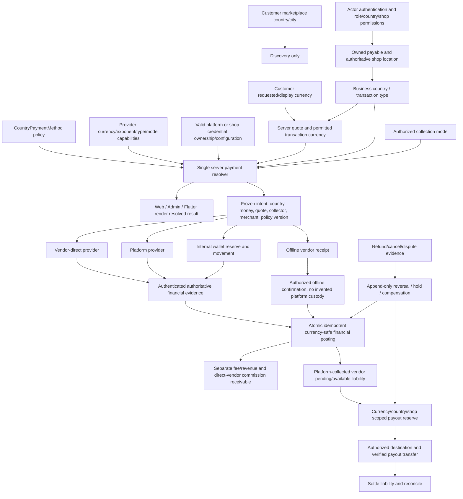

# AgendaAlly payment architecture audit and recommendations

**Date:** 2026-10-01  
**Decision status:** Historical source audit; subsequent approved implementation is
tracked in [payment-system-completion.md](payment-system-completion.md).

**2026-10-03 implementation update:** The approved common identity boundary is
implemented and migrated only in owned development: immutable global revisions,
pre-dispatch non-MTN attempts, original-evidence refund/receipt/payable operations
and native scoped UI. Original-evidence Paystack/PayPal refund defects are corrected
in the new orchestration. Historical findings below are not assertions that those
approved paths remain unimplemented. Accepted accounting remains authoritative;
electronic activation, external payout rails and production certification are absent.

**Phase 3C actual-engine stop:** the approved equivalent MySQL receipt self-anchor
database triggers pass MySQL 9/34 and SQLite 8/23 guard/migration tests.
The separately approved strict semantic JSON comparison passes MySQL 3/35 and
SQLite 3/35; selected SQLite regressions pass 50/319, retained JSON unchanged.
The separately approved MySQL UNIQUE identifier-only correction passes MySQL
2/28 and SQLite 2/28 bootstrap/migration/uniqueness checks. All original thirteen
cases now pass, 51 assertions. First expanded stale-RR-snapshot test commits
14000 refund reservations against 10000 funding despite current allocation lock.
Stop honored; no authority-read containment applied. No provider refund/API exploit
or production incident claimed; full Phase 3C remains uncertified.
The later approved current-read candidate fixed the tested refund cap (1/10) but
failed independent-allocation progress (1/5) under actual InnoDB gap/supremum locks.
It was withdrawn, preserving pre-approval application source. No broader locking,
isolation/schema changes or other financial-path fixes are authorized or made.
See [source/reproduction, protected-state proof and next approval gate](payment-phase3c-mysql-concurrency.md).

## 1. Executive summary

AgendaAlly has a real country/payment relationship, real shop gateway configuration, a collection preference, frozen provider intents, callback verification, mutable wallets, and a limited financial ledger. It does **not** yet implement a complete, consistent country → vendor configuration → transaction-currency → collection → vendor liability → payout system.

The most important findings are:

1. **Country assignment exists and is consumed.** Admin saves `country_payments`; shop-based discovery and vendor configuration consult it. Booking initiation independently resolves the shop's service country. This is not merely UI configuration.
2. **Country authority is inconsistent for products.** Cart initiation uses the customer's persisted cart country, whereas shop-specific discovery and order creation use the seller's product country. Persisting customer input does not make it authoritative business geography.
3. **The Vendor portal contains concrete wiring and ownership gaps.** The status endpoint updates nonexistent `active` instead of `shop_payments.status`. Show/update do not bind a gateway row to the authenticated shop. Generic vendor credential fields do not configure global platform gateways.
4. **Legacy credentials can be disclosed.** Public shop-payment resources return legacy `secret_id` verbatim if populated. New MTN/Orange secrets are encrypted/redacted, but that does not protect the legacy field or prevent cross-shop updates. No credential values were inspected.
5. **“Collect via platform” still exists and affects initiation.** Booking freezes the setting. Provider intent also freezes routing. However discovery does not consistently apply the same collection/configuration rules, and product orders lack the equivalent seller-payable ledger treatment.
6. **The booking payable ledger is not connected to payout eligibility.** It records pending liabilities; generic payout processing transfers from an approving user's wallet, not that liability. Payout approval lacks a reservation/atomic locking sequence.
7. **Currency is more than display, but not customer-selected foreign-currency routing.** Shop-country currency determines booking and individual order currency; cart currency can follow customer country. Rates are administered values. There is no general provider-currency capability registry or immutable FX quote/settlement model.
8. **Refund, cancellation and dispute handling are incomplete.** Booking cancellation adjusts wallets and booking payable entries, not an external provider refund. Order refund paths mix provider calls and wallet reimbursement without a unified financial reversal. The paid-transaction ledger hook also lacks a partial-wallet allocation guard, risking premature or duplicate full-value entries.
9. **Existing hardening must remain.** Verified provider evidence, frozen amount/currency/merchant/collection intent, payable ownership and replay defenses are valuable. They do not certify accounting correctness or concurrent production behavior.
10. **Only cash is active in the inspected development catalog.** All other 17 catalog entries, including wallet, are inactive and not marked sandbox. Nothing was activated.

**Recommendation:** retain all current disabling/hardening gates; first correct authorization and money-context contracts, then reuse existing structures for one server resolver and a currency-safe liability/reservation/reversal lifecycle. Do not add foreign-currency platform routing before that accounting lifecycle is complete.

### Evidence and limits

- Read-only inspection covered original Laravel, Next Customer, React Admin/Vendor and Flutter source, routes, schema definitions, existing test source and development/security documents.
- The owned local SQLite file was opened with Node's SQLite `readOnly:true` and `PRAGMA query_only=ON`. Reads were limited to schema/index metadata, payment tag/active/sandbox values, currency code/rate metadata and aggregate country-assignment counts. No customer, credential, transaction, wallet, booking or order record values were read.
- The local schema includes singular **`payment_process`**, not `payment_processes`. The former stores intent fields in `data`.
- Current local catalog: 18 methods, cash active, other 17 inactive; all `sandbox=0`. There are 18 country-assignment rows for one country, six active. Active country assignment is therefore **not** proof of globally enabled or usable checkout.
- Existing development documentation and source policy describe disabled external payments by default. Runtime environment values were not opened; no claim is made about production configuration.
- No application commands, tests, browser sessions, builds, seeds, migrations, financial mutations, provider/network calls, credential requests, workflow changes or publishing were performed. The existing previews were left unchanged.
- “Source-confirmed” means a code path or missing check was traced. It does not mean a live exploit, payment, refund, payout or concurrency outcome was demonstrated.
- Provider legal availability, actual merchant-account eligibility, settlement currencies, contractual fees and licensing were **not verified**. They require future business/provider decisions, not inference from names.

## 2. Current architecture



This diagram deliberately does not draw an implemented payable-ledger → payout connection. Provider settlement, internal wallet transfer, fee receivable, seller liability and real bank/provider remittance are different facts.

### Collection modes actually found

| Mode | Current implementation | Completeness |
| --- | --- | --- |
| Vendor direct | MTN/Orange shop-owned merchant configuration; initiation rejects global-payload gateways for shop-direct collection. | MTN has verification/status code; Orange initiation/callback are deliberately unavailable. Not live certified. |
| Platform collection | Global-payload gateways; MTN/Orange can resolve platform country configuration; shop/booking flag and provider intent participate in routing. | Partial. Booking liability entries exist, product liability and payout linkage are incomplete. |
| Cash/offline | No gateway charge; seller/manual payment transitions and order delivery state. | Offline workflow exists. A paid database state is not independent proof of cash custody. |
| Wallet | Mutable user balance, histories, checkout contribution, top-up/withdrawal and transfer flows. | Internal balance mechanism, not a provider or a reconciled vendor settlement account. Checkout wallet catalog entry is inactive locally. |

Evidence: E01–E10, E15–E18 below.

## 3. Provider inventory and capability matrices

The following three aligned tables jointly cover the requested capability and payment-flow matrix. All 18 `Payment` tags are included. **No external method is classified live FUNCTIONAL.**

**Legend**

- **B/P partial:** booking and product-cart/order source pathways exist; this is not proof of a successful provider transaction.
- **B/P gated:** names/routes/adapters exist but initiation is deliberately unavailable.
- **Country \*:** booking/shop context uses country assignments; cart initiation instead uses persisted customer cart country. Contextless catalog listing is not a jurisdiction resolver.
- **G:** global platform `PaymentPayload`. **S:** shop MTN/Orange configuration. **PC:** country-keyed platform MTN/Orange configuration.
- **Legacy refund:** an adapter exists but has lifecycle/accounting problems; not approval to call it.
- **Shared ledger:** booking/order fee records and booking-only payable records. Not provider-specific settlement or payout.

### 3.1 Availability, configuration, checkout and collection

| Method / tag | Existing code | Booking checkout | Product checkout | Country availability | Currency support representation | Credential owner | Vendor configurable / direct | Platform configurable / collection |
| --- | --- | --- | --- | --- | --- | --- | --- | --- |
| Cash `cash` | Yes, offline | Offline | Offline | Always included if globally active; pivot cannot prohibit | No provider currency capability; payable currency still matters | None | Generic status row may be saved; not consumed as shop cash enablement; offline receipt | No gateway account; flag alone proves no platform custody |
| Wallet `wallet` | Yes, internal | Internal contribution | Internal contribution | Always included if globally active; pivot cannot prohibit | Wallet currency exists; no complete cross-currency balance policy | Internal account, not credentials | Not an external merchant rail | Internal balance movement, not external collection |
| MTN `mtn` | Yes | B/P partial | B/P partial; multi-shop direct restricted | Country * | Configuration ISO currency must match intent | S or PC | Actual shop merchant configuration/direct path | Actual country platform configuration/platform path |
| Orange `orange` | Yes, gated | B/P gated | B/P gated | Country * | Configuration currency field; unreachable charge path | S or PC | Actual configuration/direct architecture, charge disabled | Actual country platform configuration, charge disabled |
| Stripe `stripe` | Yes | B/P partial | B/P partial | Country * | Zero-decimal exclusion; not a complete supported-currency registry | G | Generic vendor row is not used as Stripe credentials; direct denied | Global configuration; platform-only initiation |
| PayPal `paypal` | Yes | B/P partial | B/P partial | Country * | Service currency/precision validation; frozen payable currency, no fallback FX | G | Generic row not used; direct denied | Global configuration; platform-only initiation |
| Flutterwave `flutter-wave` | Yes | B/P partial | B/P partial | Country * | Provider-request currency and verification; no normalized capabilities | G | Generic row not used; direct denied | Global configuration; platform-only initiation |
| Paystack `paystack` | Yes | B/P partial | B/P partial | Country * | Provider-request currency and verification; no normalized capabilities | G | Generic row not used; direct denied | Global configuration; platform-only initiation |
| PayU `payu` | Yes, gated | B/P gated | B/P gated | Country * | Legacy adapter fields, not capability policy | G | Generic row only, not direct | Legacy platform configuration |
| Razorpay `razorpay` | Yes, gated | B/P gated | B/P gated | Country * | Legacy adapter fields, not capability policy | G | Generic row only, not direct | Legacy platform configuration |
| PayTabs `paytabs` | Yes, gated | B/P gated | B/P gated | Country * | Ad hoc list, including suspicious `US` identifier | G | Generic row only, not direct | Legacy platform configuration |
| Mercado Pago `mercado-pago` | Yes, gated | B/P gated | B/P gated | Country * | Legacy adapter fields, not capability policy | G | Generic row only, not direct | Legacy platform configuration |
| Moyasar `moya-sar` | Yes, gated | B/P gated | B/P gated | Country * | Legacy adapter fields, not capability policy | G | Generic row only, not direct | Legacy platform configuration |
| Mollie `mollie` | Yes, gated | B/P gated | B/P gated | Country * | Legacy adapter fields, not capability policy | G | Generic row only, not direct | Legacy platform configuration |
| ZainCash `zain-cash` | Yes, gated | B/P gated | B/P gated | Country * | Legacy adapter fields, not capability policy | G | Generic row only, not direct | Legacy platform configuration |
| Iyzico `iyzico` | Yes, gated | B/P gated | B/P gated | Country * | Legacy adapter fields, not capability policy | G | Generic row only, not direct | Legacy platform configuration |
| Maksekeskus `maksekeskus` | Yes, gated | B/P gated | B/P gated | Country * | Legacy adapter; provider banklinks are not generic bank transfer | G | Generic row only, not direct | Legacy platform configuration |
| PayFast `pay-fast` | Yes, gated; legacy mobile SDK branch | B/P gated | B/P gated | Country * | Legacy adapter fields, not capability policy | G; mobile legacy configuration references also exist | Generic row only, not direct | Legacy platform configuration; mobile path needs alignment |

There is **no standalone bank-transfer checkout tag**. Payout payment selection, banklinks and an account balance do not establish a generic bank-payment checkout rail.

### 3.2 Verification, refund, accounting and disposition

| Method | Callback/webhook | Authoritative status verification | Refund support | Settlement/accounting | Payout relationship | Current safety state | Recommendation |
| --- | --- | --- | --- | --- | --- | --- | --- |
| Cash | None required | Seller/manual state, no provider evidence | No provider refund; order/booking internal paths differ | Shared ledger/manual state; no independent cash-custody proof | No automatic liability linkage | Offline pathway; active locally; PARTIAL finance | Preserve offline workflow; distinguish paid state from collection |
| Wallet | Not a provider webhook | Internal balance/history | Separate wallet reimbursement; refund dispatcher excludes wallet | Mutable balances; split contribution recovery incomplete | Generic wallet requests, not seller payable | PARTIAL; DISABLED in local catalog | Keep inactive; establish reserve/recovery/currency policy |
| MTN | Callback triggers server status verification; not trusted as signed payment evidence by itself | Frozen merchant/config/reference/amount/currency verification and reconciliation code | No refund-dispatch branch | Shared ledger; no complete remittance | Not linked | PARTIAL; development inactive | Keep disabled pending accounting, sandbox and concurrency verification |
| Orange | Callback explicitly unavailable | Incomplete; initiation HTTP 503 | No refund-dispatch branch | No safely reachable online settlement | Not linked | UNSAFE TO ENABLE / DISABLED | Keep fail-closed; complete authoritative verifier first |
| Stripe | Signature plus authoritative session/account retrieval | Exact frozen intent verification | Legacy adapter checks succeeded | Shared ledger, not complete seller settlement | Not linked | PARTIAL; development inactive | Preserve hardening; fix finance/currency policy before sandbox |
| PayPal | Provider webhook signature verification and server capture | Merchant/order/capture/exact amount/currency verification | Legacy adapter intends completed refund | Shared ledger, not complete seller settlement | Not linked | PARTIAL; development inactive | Preserve explicit merchant/webhook requirements and no silent FX |
| Flutterwave | Secret-hash authentication plus provider lookup | Verified reference/payment/amount/currency | Legacy adapter checks completed | Shared ledger, not complete seller settlement | Not linked | PARTIAL; development inactive | Preserve verification; review refund lifecycle and finance |
| Paystack | HMAC authentication plus provider verification | Frozen reference/currency/amount/account evidence | Legacy adapter sets transaction progress on HTTP 200, not confirmed refund | Shared ledger, not complete seller settlement | Not linked | PARTIAL; development inactive | Keep disabled; correct refund semantics before exposure |
| PayU | Unavailable callback stub | Incomplete | No dispatch branch | No safely reachable new online settlement | Not linked | LEGACY / UNSAFE TO ENABLE / DISABLED | Retain identifiers; no activation |
| Razorpay | Unavailable callback stub | Incomplete | Legacy adapter sets progress on HTTP 200 | Same limitation | Not linked | LEGACY / UNSAFE TO ENABLE / DISABLED | Complete verifier and refund lifecycle, not only UI |
| PayTabs | Unavailable callback stub | Incomplete | Legacy adapter accepts HTTP 200 | Same limitation | Not linked | LEGACY / UNSAFE TO ENABLE / DISABLED | No activation; revisit currency identifiers and refund evidence |
| Mercado Pago | Unavailable callback stub | Incomplete | No dispatch branch | Same limitation | Not linked | LEGACY / UNSAFE TO ENABLE / DISABLED | Retain disabled |
| Moyasar | Unavailable callback stub | Incomplete | Legacy adapter checks refunded | Same limitation | Not linked | LEGACY / UNSAFE TO ENABLE / DISABLED | Retain disabled |
| Mollie | Unavailable callback stub | Incomplete | Legacy adapter checks refunded | Same limitation | Not linked | LEGACY / UNSAFE TO ENABLE / DISABLED | Retain disabled |
| ZainCash | No callback route in audited webhook group; unavailable controller path | Incomplete | Explicitly excluded | Same limitation | Not linked | LEGACY / UNSAFE TO ENABLE / DISABLED | Retain disabled |
| Iyzico | Process/callback unavailable | Incomplete | Legacy HTTP-status-based adapter | Same limitation | Not linked | LEGACY / UNSAFE TO ENABLE / DISABLED | Retain disabled |
| Maksekeskus | Unavailable callback stub | Incomplete | Legacy adapter checks settled | Same limitation | Not linked | LEGACY / UNSAFE TO ENABLE / DISABLED | Retain disabled; do not market banklinks as bank transfer |
| PayFast | No callback route in audited webhook group; unavailable controller path | Incomplete | No dispatch branch | Same limitation | Not linked | LEGACY / UNSAFE TO ENABLE / DISABLED | Retain disabled; align/remove live-capable legacy mobile branch only in approved work |

### 3.3 What “configured” actually means

| Configuration structure | Methods | Real checkout consumer | Important limitation |
| --- | --- | --- | --- |
| `Payment.active`, `sandbox`, `input` | Entire catalog | Catalog and initiation gates | A switch is neither verified merchant configuration nor integration readiness |
| `country_payments.active` | Assigned catalog IDs | Country helper, vendor gate, shop listing, initiation country gate | Cash/wallet exceptions; no currency/collection capability policy |
| `shop_payments.status` + newer gateway fields | Actual direct MTN/Orange; generic legacy rows accepted for others | MTN/Orange `GatewayConfig` | Broken toggle; generic Stripe/PayPal/etc vendor keys are not global configuration |
| `platform_payment_configs` | MTN/Orange | Platform-mode gateway resolver | Country-keyed, superadmin-controlled; does not configure all global gateways |
| `payment_payloads.payload` | Global gateway adapters | Global provider service/controller | Legacy configuration container; complete vault/access/rotation posture not certified by this audit |

Provider evidence: E01, E04–E09, E19–E22. Financial/refund caveats apply even to the five providers with verified callback/status source.

## 4. Country → payment relationship and enforcement

### The existing chain

`Country` ↔ `Payment` is persisted through `country_payments(country_id,payment_id,active)` with a unique country/payment index. Admin's country form includes a Payments tab, loads the catalog and saves an array of payment IDs/active flags. `CountryService` synchronizes the pivot. `Country::activePaymentIds()` consumes it and globally active payment state, with unconditional cash/wallet assignment exceptions.

Shop checkout country comes from the relevant **product or service `ShopLocation`**, with a related currency required. It is not the customer's country picker or a country inferred solely from currency.

| Boundary | Country source now | Assessment |
| --- | --- | --- |
| Admin assignment | Route-bound country ID | Real persistence, but coarse global role access without assigned-country permission |
| Vendor method creation/eligibility | Authenticated shop, product-country fallback to service-country | Country gate exists; not a shared synchronized settings row |
| Vendor method update/show | Route-bound ShopPayment row | Missing authenticated-shop ownership check; foreign-row country can be used |
| Shop-specific public listing | `shop_id` + required product/service `location_type` | Server-resolved shop country; caller country cannot broaden this path |
| Contextless public listing | Global active catalog and environment policy | No authoritative business country; unsuitable for actual checkout |
| Booking initiation | Booking's shop service country | Server country gate plus target ownership |
| Cart initiation | Stored customer cart country; single-shop fallback only if missing | Does not guarantee seller-country policy; important discrepancy |
| Individual product order creation | Each shop's product country/currency | Different from cart initiation's country/currency authority |
| Wallet/auction legacy contexts | Unique country inferred from currency | Fails when ambiguous; currency is not jurisdiction and should not be the long-term source |
| Country-manager administration | Administrative country context where dedicated middleware applies | Must remain separate from discovery/business payment context |

### Changes and mismatches

- **Customer market differs from business country:** shop listing does not broaden, but cart initiation can use that different persisted country. Ownership remains checked; business-availability authority is inconsistent.
- **Selected currency differs from business currency:** booking and individual orders resolve country currency; cart insertion can resolve customer-country currency. There is no general choice-preserving FX routing rule.
- **Shop country changes:** new vendor configuration/listing resolves current location country; existing gateway rows are not automatically synchronized/revoked by a demonstrated workflow. Booking collection mode is frozen, but no complete business-country/policy-version migration lifecycle was established. Existing paid records must not be reinterpreted.
- **Product/service countries differ:** vendor configuration chooses product then service country; individual checkout chooses its transaction type. One shop-level gateway configuration is not necessarily eligible for both.
- **Multi-shop cart:** direct mobile-money is restricted; one resolved merchant cannot be assumed. No fully defined multi-country/multi-currency/platform allocation protocol was established.
- **Cash/wallet:** Admin cannot prohibit them through the country pivot alone; global activation still matters.

Evidence: E02–E08, E23–E25.

## 5. Vendor configuration and existing UI

### Controls traced through API and persistence

| Control | UI/API → storage → checkout | Actual effect / gap |
| --- | --- | --- |
| Add/edit shop method | Vendor Payments → seller `shop-payments` → requests/service → `ShopPayment` | Country-constrained creation; update/show missing row ownership |
| Enable/disable | Vendor status action → `shop-payments/{id}/active/status` → service | Writes `active`, but schema/checkout use `status`; confirmed wiring defect |
| Orange credentials | Specialized fields → encrypted merchant key plus client identifier/config | Direct configuration exists; provider initiation remains unavailable |
| MTN credentials | Specialized fields → encrypted subscription/API credentials and environment/currency | Real direct merchant configuration consumer |
| Generic provider credentials | Generic client/secret fields, some additional UI keys | Global gateway services do not consume these shop rows; misleading configuration surface |
| Cash/offline | Form omits provider credentials; generic status can be stored | Shop cash row is not consulted by general cash availability |
| Wallet | Internal balance UI and generic method form | Not a merchant configuration or independent vendor payable wallet |
| Collect via platform | My Shop switch → no-body toggle endpoint → current shop boolean | Present and wired, but retrying a toggle is not an idempotent “set desired value” contract |
| Payout | Generic payout request/payment/currency/amount/cause | User-wallet request; no structured payout destination or liability allocation in Payout model |
| Bank details | No dedicated checkout bank rail or structured Payout destination found in audited contracts | Do not infer transfer capability from a method dropdown |

**Who changes collection?** Seller controller operates on the authenticated shop; the switch is present in My Shop. Shop request validation also accepts the boolean field. A dedicated Admin override workflow/UI was not established. Do not assume this is a fully authorized platform-onboarding decision simply because an owner can toggle it.

### Other UI surfaces

- **Customer Web:** service booking payment, product-group checkout, wallet contribution/history and currency selector. Cash/offline and wallet are separately described. Payment selection is local checkout state; no reusable saved-card/token vault was established.
- **Admin:** global payment catalog/configuration, country Payments tab, currency/rate editing, transaction/report screens, payout administration and country platform MTN/Orange configuration.
- **Vendor:** My Shop collection switch, Payments configuration, transaction/refund/payout and balance-related screens.
- **Flutter:** payment selection sheet/screen, booking payment sheet, cart/payment processing, wallet/transaction models and legacy provider-specific handling. Flutter payment listing currently sends only language.
- Forms and routes are evidence of controls, not evidence of successful collection, bank settlement, refunds or payout.

Evidence: E05, E06, E23, E26–E29.

## 6. Currency handling: display, storage, payment and settlement

| Concept | Current representation | Meaning |
| --- | --- | --- |
| Business country currency | `countries.currency_id`; product/service location country | Default/resolved booking and order currency |
| Selected storefront currency | Web settings/cookie/profile; Flutter local selection | Display/request preference, not guaranteed transaction currency |
| Currency conversion metadata | `currencies.title/symbol/rate/default/active` | Admin-maintained rate; no audited external feed or immutable quote |
| Cart currency | `carts.currency_id/rate` | Product insertion can overwrite client values with customer cart country's currency/rate |
| Booking currency | `bookings.currency_id/rate` | Calculation resolves shop service country; stores normalized amounts and exposes rate-adjusted accessors |
| Product order currency | `orders.currency_id/rate` | Each shop's product country, even if cart/provider currency differs |
| Wallet currency | `wallets.currency_id` | Balance denomination exists; cross-currency reserve/debit policy is not complete |
| Provider charge currency | `PaymentProcess.data` currency and amount; payable-derived payload | Booking currency or cart currency, not arbitrary selected UI currency |
| Provider settlement currency | No separate normalized snapshot established | Not modeled as a verified settlement/FX contract |
| Ledger currency | `platform_fee_ledger_entries.currency_id`, amount | Entries use raw payable fee/seller-fee values; non-unit-rate denomination must be verified |
| Payout currency | `payouts.currency_id` | Request field; approval does not demonstrate matching balance currency/FX enforcement |

### Concrete trace

1. Web chooses a currency and records it in settings/cookie/profile.
2. Web/Flutter send `currency_id` and sometimes `rate` with cart requests.
3. Backend cart creation paths resolve rate from the Currency record; product insertion can instead overwrite both currency and rate with submitted cart-country currency. Client float rate is not authoritative in those traced paths.
4. Booking calculation selects shop-country currency/rate. Booking storage normalizes values by rate; `rate_*` accessors multiply back.
5. Cart-to-order creation assigns each seller order its shop-country currency/rate.
6. Provider initiation calculates booking/cart totals server-side, subtracts wallet contribution and creates the intent's currency/amount. Ordinary client `total_price` is not the authority.
7. The common intent conversion uses `round(major_amount * 100)` rather than a universal currency-exponent model. Stripe excludes zero-decimal currencies to protect its current contract. PayPal rejects unsupported precision/currency rather than silently converting.
8. There is no demonstrated frozen FX quote linking cart charge currency, each order currency, provider settlement currency and seller payable currency.

**Rates are not a live FX service.** Currency model comments describe a USD-relative convention; inspected development metadata instead has XAF/XOF rate 1 and USD approximately 1/600. These are development reference values, not market quotes. Code comments, base denomination and seeded rate convention must be reconciled before certified cross-currency accounting.

**Ledger limitation:** raw `service_fee`/`seller_fee` and `currency_id` are copied into entries, while payable `rate_*` amounts differ when rate ≠ 1. This audit does not certify their end-to-end denomination. Furthermore `payableBalanceForShop()` sums by shop without currency grouping. That aggregate cannot safely become a multi-currency payout balance.

Evidence: E07, E10, E11, E24–E28.

## 7. Checkout flow comparison

| Step | Service / booking | Product / cart / order | Flutter difference |
| --- | --- | --- | --- |
| Context | Shop service location; existing customer-owned booking | Cart ownership and customer country; eventual orders per shop product country | Listing lacks shop/cart/location/currency context |
| Method loading | Web provides shop, service location and selected currency | Web can provide shop/cart/product context; contextless fallback is broader | GET payments sends language only |
| Country filter | Shop list and booking initiation consult country allowlist | Shop list consults seller country; cart initiation consults cart country | Global catalog can offer methods that initiation rejects |
| Currency filter | Listing uses country currency, Stripe-specific filter | Not a shared selected-currency resolver | No requested currency filter through listing |
| Collection | Booking frozen flag; provider intent freezes routing | Intent resolves shop preference; no order-level payable snapshot equivalent | DTO does not expose full capability/collection contract |
| Initiation | Owned target, active method, country and configuration checks | Owned cart, calculated total and method/country gates | Shared backend still enforces initiation |
| Success evidence | Verified provider intent, or manual cash state | Same hardened boundary; paid cart can create orders | Browser/mobile return is not authoritative payment evidence |
| Persisted state | PaymentProcess + booking/child transactions | Cart intent + transactions + resulting order records | Old DTOs must retain existing fields/status semantics |
| Commission/accounting | Fee memo plus booking platform payable | Fee memo only for orders; delivery/partner wallet flows separate | No client should infer settlement from a paid status |
| Cancellation/refund | Wallet adjustments and booking payable adjustment | Provider cancellation refund trait and separate order refund wallet path | Needs additive refund status, not fake success redirect |

**Special booking amount exceptions:** tip payments use a client percentage, and extra-time payment can use submitted `price` when the owned booking is in progress. PaymentRequest does not validate/link those extra-time fields to an authorized persisted extra-time charge. This is a separate amount trust boundary, not a claim that ordinary booking totals are client-controlled.

Evidence: E04, E07–E10, E12–E14, E26–E29.

## 8. Platform collection versus vendor collection

The exact field remembered by the creator is **`Shop.collect_via_platform`**.

- Database: shop boolean; a later booking migration adds the corresponding booking snapshot.
- UI: Vendor **My Shop → Collect via platform** switch.
- API: `POST /api/v1/dashboard/seller/shops/collect-via-platform`.
- Controller/service: authenticated current shop; service toggles its flag.
- Booking: freezes the setting at creation.
- Provider initiation: freezes `collect_via_platform`/`checkout_collection_mode` in intent data. Global-payload methods require platform mode; MTN/Orange resolve shop or platform configuration according to mode.
- Product: intent routing exists, but the order model/observer does not implement the corresponding seller-payable snapshot/entry.
- Flutter: can use the same initiation backend; its catalog contract does not carry sufficient collection eligibility context.
- Admin override: no separately certified override workflow was found.

### Configuration mismatch

For MTN/Orange, shop-specific listing always requires shop credentials even when platform collection should use platform credentials. Conversely it can show global gateways for a shop whose direct mode makes initiation reject them. A single resolver should evaluate the exact same collector/account/configuration before display and charge.

**A flag is not proof of custody.** A paid transaction plus `collect_via_platform` can trigger bookkeeping. Actual collector ownership must be established from the verified intent/payment rail, and cash/manual state must not be silently treated as platform-held provider funds.

## 9. Accounting and settlement

### Current records and their responsibilities

| Record | Financial role | What it does not prove |
| --- | --- | --- |
| Transaction | Payable-linked amount, payment system/reference, status | Independent bank settlement or a balanced ownership journal |
| PaymentProcess | Model/user + immutable provider intent/proof state in JSON | Complete FX, reserve, refund and payout journal |
| Booking / Order | Total, fee, commission, discount, rate/currency; booking collection snapshot | Platform cash custody |
| Wallet / WalletHistory | Mutable balance and internal debit/credit/history | Seller liability attributable to a verified platform charge |
| PlatformFeeLedgerEntry | Fee receivable; booking payable; signed payable adjustment; pending/collected/waived | Actual funds movement; unified double-entry accounting |
| PaymentToPartner | Separate order partner bookkeeping/manual completion | Integration with the platform payable ledger |
| Payout | Creator/approver, amount/currency/method/status/cause/answer | Verified bank destination, funds reserve or provider transfer |
| Order refund records | Customer request and wallet/partner reimbursement flow | Complete provider refund and payable/fee reversal |

### Confirmed equations and triggers

- A paid Booking or Order transaction can create a pending fee entry: `amount = payable.service_fee`.
- A paid Booking with its frozen platform flag can create a pending payable: `amount = booking.seller_fee`. Orders have no equivalent seller-payable branch.
- Booking cancellation adds `−original payable amount` entries, not destructive rewrites.
- Ledger payable balance is the sum of uncollected payable and payable-adjustment amounts; current helper is shop-wide, not currency-grouped.
- Checkout wallet contribution: `customer balance_after = balance_before − contribution`, with a paid wallet transaction/history before the external remainder succeeds.
- Accepted wallet-method payout: `creator wallet + payout amount`, `approver wallet − payout amount`; this does not debit/settle the booking payable ledger.
- Order delivery also has a separate Admin-wallet top-up of the full order total. It must not be described as net platform revenue or verified provider custody.

Raw seller-share formulas found:

```text
booking seller_fee =
    total_price − service_fee − commission_fee − coupon_price

order seller_fee =
    total_price − in-house_delivery_fee_if_applicable
                − service_fee − commission_fee − coupon_price − tips
```

Platform fee and commission fields exist; the observer's `fee` entry records `service_fee`, not an independently verified full commission journal. Presence of these formulas is **not certification** that fee basis, rate denomination, refunds, wallet balances and actual collector ownership reconcile correctly for every transaction type.

**Who actually gets wallet credit?** Paid booking/cart branches of `BaseService::afterHook()` do not directly top up the seller or Admin wallet. Its paid-wallet branch credits a customer wallet top-up. Separately, `PaymentToPartnerService` supports wallet/cash partner payment: wallet mode can top up the seller and withdraw from the authenticated paying user's wallet, with inverse direction for negative seller fee; cash writes partner transaction records without wallet movement. This separate manual/partner-payment pathway is not linked to the platform payable ledger and does not certify vendor receipt of gateway funds.

### Important boundaries

`TransactionObserver` runs for paid-state accounting; failed provider settlement does not ordinarily create its paid-only entries. However a split-wallet component is already debited and recorded paid before the external remainder outcome. There is no established automatic failure unwind in that callback branch.

**Partial-payment ledger risk:** the observer checks paid status and Booking/Order type, not payment tag, contribution amount or whether the entire checkout settled. A paid partial-wallet Booking transaction can therefore create full booking service-fee and platform seller-payable entries before the external remainder succeeds. Entry uniqueness is per transaction/type, not per complete booking allocation: another distinct paid transaction can have its own full-value entries. This is a source-level premature/duplicate posting risk; exact runtime transaction reuse and resulting balances were not tested. Intent replay hardening is not sufficient to certify these separate accounting hooks.

The local ledger has a unique `(transaction_id,entry_type)` index. Country assignments have a unique country/payment index. Local transactions have lookup indexes but no observed provider-reference settlement uniqueness constraint, and payouts have no local index enforcing reservation/idempotency. Existing row locks and hardening are valuable; production-engine race certification remains separate.

Evidence: E10–E18.

## 10. Payout lifecycle and limits

### Flow found

`User/creator payout request → pending row → Admin statusChange → wallet checks → status/approver update → wallet-method internal transfer and generic wallet transactions`.

This is **not**:

`reconciled shop/country/currency payable → reserved vendor funds → verified external payout → liability settled`.

| Requirement | Current observation |
| --- | --- |
| Creator authorization | Seller create/list force authenticated creator; show checks creator |
| Update ownership | Seller bound-row update does not enforce creator/shop and accepts mutable creator/amount/currency/payment fields |
| Administrative country scope | Read routes carry `country.permission:transactions.view`; mutation/status routes are outside that block |
| Shop/country allocation | Payout is user-owned, not explicitly allocated to a shop liability/country |
| Currency | Stored field; approval does not prove balance currency match or FX |
| Payout method | Payment ID; wallet branch performs internal transfer |
| Destination | No structured beneficiary/bank/account/provider destination snapshot in Payout schema |
| Minimum/maximum | Nonnegative request amount validation; no established policy min/max |
| Pending reserve | None established |
| Atomic approval | No encompassing transaction/row locks in approval service |
| Duplicate protection | Already-accepted check exists, but is check-then-write and race-prone |
| Rejection/cancellation | Can still emit generic transaction rows; transfer history only for accepted wallet branch |
| External completion | No independent external payout processor/transfer proof found in this flow |
| Ledger settlement | No payout consumption of `payableBalanceForShop()` or `markCollected()` |

**Known legacy concern preserved:** user/creator-level payout and subscription geography is not equivalent to explicit country-owned finance. A local invitation or one convenient shop must not attribute all creator money to that country. This audit does not fix that separate concern.

Evidence: E15–E18 and existing country-finance hardening documentation.

## 11. Refund, cancellation, reversal and dispute

| Event | Current effect | Financial gap |
| --- | --- | --- |
| Booking cancellation | Cancellation rules mutate customer wallet; wallet-paid case credits total then applies charge; noncash path can debit customer wallet; booking payable adjustment is appended | No provider refund; fee entry remains; paid external funds and wallet action need reconciliation |
| Parent booking cancellation | Separate child/customer-wallet logic and payable reversals | Must not assume identical single-booking cancellation economics |
| Order cancellation | Noncash invokes refund trait inside order-status transaction | Non-throwing unsuccessful provider response can still allow cancellation; refund success is not a shared required outcome |
| Explicit order refund acceptance | Customer wallet credit, possible seller/delivery wallet withdrawal if prior partner transaction paid; digital-download exclusions | Not necessarily refund to original provider; no corresponding platform fee/payable adjustment |
| Provider refund succeeds | Adapter-specific transaction state updates | No universal balanced seller/platform/wallet reversal |
| Provider refund fails | Inconsistent response/exception handling; no common refund-failed/reconciliation workflow | Pending/failed state and retry/idempotency requirements incomplete |
| Payment dispute/chargeback | No handler/state found in audited paid/canceled/rejected/progress path | No liability hold, fee loss or dispute recovery accounting |
| Callback arrives twice | Hardened frozen-intent replay defenses, row locking and terminal-state checks | Production simultaneous-event behavior not certified by source/sequential tests |
| Callback arrives late | Paid state cannot be downgraded; alternative paid intent is guarded | Late payment after business cancellation still needs explicit accept/refund/reconciliation policy |
| Split wallet + failed remainder | Wallet debit precedes external outcome | Automatic recovery/re-credit not established |
| Refund after payout | No integrated payable/reserve/debt lifecycle | Need vendor recovery/negative balance policy before platform collection expansion |

Refund dispatcher currently excludes cash, wallet and ZainCash. There is an unreachable wallet branch, plus no default handler for several tags. MTN/Orange/Mercado Pago/PayU/PayFast have no dispatch branch. Paystack/Razorpay adapters set progress on HTTP success instead of confirmed refund; PayTabs uses HTTP 200 rather than sufficient financial evidence.

Legacy refund methods can still exist for providers whose initiation/callback is disabled. Their presence is **not permission to use them**, or proof they honor the same frozen credential/mode/currency contract as hardened initiation. Reconcile refund identifiers, credential ownership, exact amounts/currency, partial allocations and failure state before enabling any refund path.

Evidence: E12–E14, E19.

## 12. Security findings and parameter authority

| Parameter | Current protection | Remaining issue |
| --- | --- | --- |
| Customer/payable ID | Initiation rechecks owned booking/cart/wallet/parcel etc; ambiguous targets rejected | Preserve these checks; reusable offerings intentionally have separate purchase semantics |
| Country | Shop and booking resolve business context | Cart uses customer-derived context; Admin assignment lacks assigned-country check |
| Shop | Vendor create overwrites supplied shop ID | Gateway show/update route row is not constrained to that shop |
| Vendor/creator | Payout create/list force actor | Payout update allows route-bound foreign record and creator changes without visible owner guard |
| Payment/provider | Active/catalog/country/environment/verified-intent checks | Discovery and initiation use different collection/configuration rules; stubs must stay unavailable |
| Currency | Payable/cart currency is used, client rate overwritten in traced paths | No general capability resolver, FX snapshot or payout currency match |
| Collection mode | Booking and provider intent freeze mode | Product liability snapshot incomplete; flag is not actual collection evidence |
| Amount | Ordinary booking/cart totals calculated server-side, exact provider proof required | Extra-time `price` and tip policy validation; universal two-decimal assumption; wallet/refund allocations |
| Commission | Stored fields/server calculations | Denomination, reversal and correct revenue-vs-liability interpretation not certified |
| Payout destination | No real structured destination in audited model | Cannot claim secure destination authorization or verified transfer |
| Secrets | Four newer mobile-money secret fields encrypted/redacted; platform config controller restricted | Public legacy secret resource and cross-shop rows; global payload vault/rotation access not certified |

**Highest-priority confidentiality finding:** `GET /api/v1/rest/shop-payments/{id}` returns a shop's ShopPayment resources, whose legacy `secret_id` is not redacted. If populated with a real secret, this is unauthenticated disclosure. Actual stored contents were not inspected; source missing redaction is confirmed. Treat exposed real credentials as requiring provider-side rotation in separately approved work, not merely UI hiding.

**Highest-priority write findings:** gateway row ownership, payout row ownership, country-policy administration scope and payout atomicity.

The audit did not exploit these endpoints, change authorization or inspect secrets.

## 13. Web / Admin / Flutter compatibility

| Shared contract | Web / Admin use | Flutter use / constraint | Recommended compatibility approach |
| --- | --- | --- | --- |
| REST payments | Web sends selected currency + shop/location/cart | Flutter sends language only; Payment DTO has basic catalog fields | Add contextual resolver contract; old catalog remains non-authoritative; update Flutter fetch signature |
| Currency | Web selector/settings/profile + Admin manual rates | Selected currency/rate in local storage and payloads | Retain IDs/rate fields; add explicit quote/display/charge/settlement currency metadata |
| Gateway process | Authenticated booking/cart IDs and wallet contribution | `/dashboard/user/{name}-process`; provider-specific response handling | Preserve v1 names and response fields; add validation/error codes without success simulation |
| Manual transactions | `/payments/{type}/{id}/transactions` | Order transaction creation uses same route family | Do not let browser/mobile success authorize payment state |
| Shop configuration | Admin/Vendor credential/status forms | Shared resources/models may be consumed by mobile | Redact secret fields; configured booleans and blank-means-unchanged update semantics |
| Collection flag | Vendor My Shop and ShopResource | Shared shop/booking resources | Keep original boolean compatibility; introduce explicit modes additively |
| Wallet / payouts / refunds | Balance/history and admin/seller workflows | Existing basic state/DTO assumptions | Do not relabel wallet as vendor liability; add reserved/available/refund lifecycle fields |

No recommendation requires a silent migration to a different framework or API. Laravel `/api/v1` remains authoritative; Node/Canvas scaffolding is not this product.

## 14. Prioritized gap and risk matrix

Classification: **A** UI-only mismatch; **B** missing API wiring; **C** missing enforcement; **D** model limitation; **E** accounting/settlement; **F** incomplete provider; **G** security/scope; **H** legacy/dead configuration; **I** works correctly in source; **J** provider/business decision.

| Priority | Finding | Class | Severity | Evidence / confidence | Required disposition |
| --- | --- | --- | --- | --- | --- |
| P0 | Public legacy `secret_id` serialization | G/H | HIGH; potentially critical if live secrets were stored | Source-confirmed, contents not read; E05/E06 | Remove public secret contract and review/rotate any actual exposures in approved work |
| P0 | Gateway show/update not actor-shop bound | G/C | HIGH | Source missing ownership guard; no exploit test; E05/E06 | Owner-bound reads/writes and regression fixtures |
| P0 | Seller payout update not creator/shop bound; creator mutable | G/C | HIGH | Source candidate; E16/E17 | Actor ownership and immutable financial identity |
| P0 | Country assignment/admin payout mutations lack assigned-country guard | G/C | HIGH | Route/controller mismatch confirmed; E03/E16 | Explicit global authority or country-scoped permission |
| P0 | Payout approval check/write race and no reserve | E/G | HIGH | Source-confirmed sequence; E16 | Atomic reserve/approve/complete/release lifecycle |
| P0 | Booking liability disconnected from payout; order seller liability absent | E/B | HIGH | Observer and consumer search; E10/E15/E16 | Reconciled currency/country allocated liability before payout |
| P0 | Paid partial-wallet transaction can post full booking fee/payable; uniqueness is transaction-level | E | HIGH | Source hook lacks contribution/completion guard; runtime reuse not tested; E07/E10 | Allocation-aware exactly-once posting, not full totals for each paid component |
| P0 | Legacy refund/reimbursement/reversal inconsistency | E/F | HIGH | Source-confirmed; E12–E14/E19 | Freeze refund ownership/amount and balanced posting policy |
| P1 | Vendor toggle writes `active` rather than `status` | B/C | HIGH | Source + local schema confirmed; E05 | Correct bounded endpoint wiring with owned-row tests |
| P1 | Product cart jurisdiction differs from seller business jurisdiction | C/D/J | HIGH | Source-confirmed; E07/E24/E25 | Business-country intersection/partition rule, not buyer-country authority |
| P1 | No shared provider-country-currency-mode resolver | C/D | HIGH | Source-confirmed; E04/E07/E08 | One resolver used by list/config/initiation |
| P1 | Split-wallet failure/recovery not established | E | HIGH | Debit traced, unwind not established; E07/E11 | Reserve/debit/release and exactly-once compensation |
| P1 | Extra-time amount not tied to approved persisted charge | C/G/J | HIGH | Source trust boundary, business policy unresolved; E07/E09 | Authoritative extra-time quote + validation |
| P1 | Raw/rate money denomination and shop-wide multi-currency sum not certified | D/E | HIGH | Amount/accessor mismatch needs proof; currency grouping absent; E10/E15/E24 | Define units/exponents; currency-separated totals and tests |
| P1 | Flutter listing context absent; Web selected currency ignored by general filter | A/B/C | HIGH | Source-confirmed; E04/E26/E28 | Contextual additive v1 resolver and all-client rollout |
| P1 | Orange and ten other gateways deliberately unavailable | F/H | HIGH if enabled; currently fail-closed | Source guards; E19–E22 | No gate removal; provider-specific verifier/fixtures |
| P2 | Discovery and initiation disagree on collector/configuration | A/B | MEDIUM | Source-confirmed; E04/E07 | Resolver-driven display |
| P2 | Generic vendor provider credentials do not configure global rails | A/H | MEDIUM | Source-confirmed; E05/E23/E27 | Show actual ownership/capability, not dead credential fields |
| P2 | Cash/wallet cannot be prohibited by country pivot | C/J | MEDIUM | Source design; E02 | Explicit country/offline/wallet business policy |
| P2 | Empty Stripe currency passes helper | C | MEDIUM | Helper confirmed; normal shop context reduces reachability; E08 | Fail closed on missing/invalid currency |
| P2 | No dedicated payout destination/min-max/completion contract | D/J | HIGH before external payout | Model/service absence; E16/E17 | Verified beneficiary and provider transfer identity |
| P2 | Country change and mixed-country cart lifecycle unspecified | D/J | MEDIUM | No complete lifecycle found | Freeze policy; invalidate new unsafe quotes; partition or reject |
| Preserve | Country pivot persistence, owned target checks, verified callbacks, frozen routing, replay guards | I | LOW / positive control | Source-confirmed; not live certified | Retain and extend, never bypass |
| Business gate | Legal markets, currencies, merchant-of-record, settlement/fees/disputes | J | HIGH | UNKNOWN / requires provider/business verification | Obtain explicit approved capability policy, no speculative country seeds |

Inactive local providers reduce immediate online exposure but do not remove confidentiality, authorization or accounting design defects.

## 15. Recommended target architecture



The smallest safe target retains existing models, routes and adapters. It introduces normalized capability/money context and links existing liability bookkeeping to actual financial posting/reservation; it does not add a competing payment catalog or substitute a second backend.

### Resolver rule

```text
available_methods =
    globally enabled and integration-ready methods
  ∩ applicable authoritative business-country policy
  ∩ supported transaction currency and precision
  ∩ supported transaction type
  ∩ authorized collection mode
  ∩ valid configuration for the exact collector/merchant
  ∩ vendor enablement where that method is genuinely vendor-configurable
  ∩ environment/provider policy
```

If buyer market also imposes legal restrictions, it adds a constraint; it never replaces/broadens seller-country policy. For multiple shops/countries/currencies, partition into explicitly quoted allocations/intents or fail closed. Do not invent one vendor, country or currency for the whole cart.

## 16. Recommended business rules

1. Resolve business country from the authorized shop's transaction-specific business location; customer discovery country and manager authorization remain separate.
2. Vendors cannot enable a method unavailable to that business country or unsupported for the transaction type/mode. A generic catalog row is not vendor ownership of a platform merchant account.
3. Country assignment does not activate a provider or certify legal/currency support.
4. Distinguish requested/display currency, authoritative charge currency, settlement currency and vendor payable currency.
5. Reject unknown currency, unsupported precision and missing quote context. Currency exponent is not universally two.
6. Any FX must have an immutable server quote: source/destination money, rates, rounding, fees, expiry and collector/settlement allocation. No silent USD fallback.
7. Platform credentials are platform-only; shop-direct credentials are actor-shop bound and encrypted/redacted. Public resources never return secret values.
8. Configuration uses idempotent “set enabled/desired mode” contracts, not retry-sensitive toggles.
9. Country/mode/merchant/amount/currency/config fingerprint are frozen before provider initiation; subsequent shop-setting changes do not reinterpret a payment.
10. Only authenticated authoritative provider evidence can settle external payments. Browser/mobile redirect status is never financial evidence.
11. Ordinary amounts, fees and extra-time charges derive from authorized server records. Customer tips need explicit validation/policy, not unchecked arithmetic.
12. Cash/offline records never invent platform-held cash or an externally funded wallet. Collection flag alone is insufficient custody evidence.
13. Platform-collected bookings **and products** create auditable seller liability in explicit currency/country/shop allocation; provider funds and platform revenue are separate.
14. Customer wallet balance, vendor payable and approving Admin wallet are different accounts, even if owned by the same user.
15. Wallet split contributions reserve/debit/release exactly once; failure, expiry and cancellation compensate safely.
16. Payout availability comes from reconciled vendor liability less reserves/holds, with verified destination, currency, permissions, limits and atomic locking.
17. Payout request, approval, transfer submission and completed transfer are distinct states. Rejection releases a reserve, not a phantom transfer.
18. Refund/cancel/dispute posts append-only balanced adjustments, reverses applicable fees/payables, and accounts for any prior payout/negative recovery.
19. Existing paid states cannot be downgraded by duplicate/late callbacks. Late success after cancellation requires reconciliation/refund policy.
20. Country changes affect future eligibility; historical country/money/collector snapshots remain immutable. Ambiguous legacy finance is quarantined for authorized reconciliation, not guessed from invitations.
21. Web, Admin/Vendor and Flutter render the same server decision. Older v1 fields remain compatible but contextless catalog responses are not checkout authorization.
22. Enabling each provider requires separate approved test-account configuration, provider-specific verification/refund/reconciliation evidence and business sign-off.

## 17. Data-model recommendations: reuse before extending

| Target concept | Existing equivalent | Minimum extension / decision |
| --- | --- | --- |
| PaymentMethod | `payments`, Payment tags | Reuse IDs/tags; add explicit integration readiness, type/mode capabilities rather than duplicate catalog |
| CountryPaymentMethod | `country_payments` | Reuse unique pivot; explicit permitted mode/market policy if needed; remove accidental cash/wallet exception only after business approval |
| PaymentMethodCurrency | No normalized equivalent | Add method/currency capability relation with exponent/constraints and verified-policy provenance; country-specific overrides only if necessary |
| VendorPaymentMethod | `shop_payments` | Reuse `status`, actor-shop binding and real credential owner; distinguish enabled preferences from merchant credentials; unique shop/method invariant if required |
| CollectionMode | Shop/Booking booleans + intent mode | Add explicit canonical mode/type snapshot for orders/allocations; retain boolean API compatibility |
| ProviderConfiguration | `payment_payloads`, `platform_payment_configs`, `shop_payments` | Keep owner distinction; normalized credential reference/status/fingerprint and access rules; do not copy global keys into vendors |
| Financial intent | `payment_process.data` | Add business-country, quote/currency exponent, authoritative charge/settlement/payable allocation and policy/version snapshots; promote constraints to columns where necessary |
| FX quote | Rate fields only | Add immutable quote if foreign charge/settlement is approved; no quote needed merely to retain local-currency checkout |
| Transaction | `transactions` | Stable provider reference/idempotency identity, financial posting references and explicit charge/refund linkage |
| Vendor liability / fee | `platform_fee_ledger_entries` | Extend existing journal/entry types or link balanced postings; include order liability, currency/units/country allocation, reserves and reversals |
| Wallet | `wallets`, `wallet_histories` | Preserve customer internal balance; reserve/money-exponent rules; do not repurpose it as implicit seller escrow |
| Payout | `payouts` | Liability allocation, reservation, immutable currency/destination, idempotency key, transfer/proof states and actor scope |
| Refund | Order refund records + transaction/adapter paths | Unified immutable refund intent, allocation, provider outcome, compensation/reversal and dispute link |
| Partner payment | `payment_to_partners` | Define whether retained as manual settlement or integrated into liability posting; no double credit |

Do not run migrations during this audit. Future migrations should be additive and reviewed; historical transaction ownership/denomination requires reconciliation before any backfill. Do not recalculate accepted marketplace history from current shop/country/rate settings.

## 18. Existing endpoint matrix and recommendations

All paths below start with `/api/v1`. Resource means the registered Laravel resource methods, not blanket permission to every action. Route spelling and prefix are important: provider initiation is **`dashboard/user/...-process`**, while manual transaction routes are **`payments/...`**, not `dashboard/payments/...`.

| Group / endpoint | Purpose | Authentication / scope source | Country behavior | Currency behavior | Main consumer | Observed gap |
| --- | --- | --- | --- | --- | --- | --- |
| Public `GET rest/payments` | Catalog / contextual method discovery | Public; optional shop/location/cart | Shop path resolves business country; no-shop path global | Shop filter uses country currency, Stripe only | Web + Flutter | Selected currency not general filter; Flutter context absent |
| Public `GET rest/payments/{id}` | Method detail | Public + environment policy | Not full checkout authorization | Not unified capability contract | Shared clients | Detail/catalog must not imply actual eligibility |
| Public `GET rest/shop-payments/{id}` | Shop payment rows | Public, requested shop ID | No actor-shop restriction needed for public metadata, but secrets prohibited | Returns gateway config metadata | Shared clients | Legacy secret resource exposure |
| Public `GET rest/currencies/active` | Currency catalog | Public | Not business jurisdiction | Manual rate/code catalog | Web + Flutter | No immutable FX/settlement quote |
| Customer `PUT dashboard/user/profile/currency/update` | Preference | Sanctum, profile actor | Discovery preference only | Selected currency | Web/mobile | Not transaction authorization |
| Customer cart create/insert/open paths | Product cart context | Sanctum and cart owner | Customer country can set cart country | Rate overwritten from server record; product insert may use country currency | Web + Flutter | Does not prove seller-country eligibility |
| Customer `dashboard/user/bookings` resource; `POST bookings/{id}/status/update` | Booking creation/cancellation | Sanctum, customer booking context | Shop service country | Calculated booking currency/rate | Web + Flutter | Cancellation/provider-refund mismatch |
| Customer `POST payments/{type}/{id}/transactions` | Manual transaction creation | Sanctum + controller target checks | Payable-dependent | Payable amount/status | Web + Flutter | Not provider verification |
| Customer `PUT payments/{type}/{id}/transactions` | Manual payment status | Sanctum + role/override reason policy | Payable-dependent | Existing transaction | Shared clients | Preserve cash-only seller confirmation / authorized audited noncash override |
| Customer `POST dashboard/user/{provider}-process` | Gateway initiation | Sanctum + PaymentRequest/BaseService owner checks | Booking business country vs cart country | Calculated booking/cart intent, some service checks | Web + Flutter | Shared resolver/FX/accounting missing |
| Customer `GET dashboard/user/mtn-process/{referenceId}/status` | MTN polling | Authenticated controller and frozen intent | Merchant/config resolution | Frozen currency/amount | Mobile money UI | Requires valid intent/config; not blanket account status access |
| Customer `GET dashboard/user/wallet/histories`; `POST wallet/withdraw`, `wallet/send`, `wallet/history/{uuid}/status/change` | Internal wallet history/requests | Sanctum/user wallet context | Not an explicit seller country liability | Stored wallet currency | Web + Flutter | Not vendor settlement |
| Customer `dashboard/user/order-refunds` resource / paginate/delete | Refund requests | Sanctum/customer order context | Order-associated | Original order values | Web + Flutter | Wallet reimbursement and provider outcome not unified |
| Vendor `GET dashboard/seller/shop-payments` / `shop-non-exist` | Own rows / eligible methods | Sanctum, seller/check.shop, `payments.view` | Authenticated shop country eligibility | Default mobile-money config currency | Vendor portal | Generic methods misleading; product/service fallback |
| Vendor `GET/PUT dashboard/seller/shop-payments/{shopPayment}` | View/update | Read/manage shop permission; bound row | Row country, no owner check | Gateway config field | Vendor portal | Source-confirmed missing row binding |
| Vendor `POST dashboard/seller/shop-payments`; delete routes | Create/remove configuration | `payments.gateways.manage`, actor shop; delete filters owner | Country gate | Config currency, not capability registry | Vendor portal | Legacy credential fields persist |
| Vendor `POST dashboard/seller/shop-payments/{id}/active/status` | Toggle | Manage permission; service checks row shop | Existing row | None | Vendor portal | Wrong `active` column |
| Vendor `POST dashboard/seller/shops/collect-via-platform` | Collection toggle | Seller authenticated current shop | Shop context | Not an FX decision | Vendor My Shop | Coarse toggle, no certified onboarding/override workflow |
| Vendor transaction read/update routes | Transactions/manual operations | `payments.view` / `payments.payouts.manage` | Shop context | Existing records | Vendor portal | Do not equate reads/status with payout liability |
| Vendor `dashboard/seller/order-refunds` read/update/delete | Refund review | View / `payments.refunds.manage` | Shop/order context | Original order values | Vendor portal | No unified ledger reversal |
| Vendor `dashboard/seller/payouts` read/create/update/delete | Generic requests | View/manage shop permission; creator checks vary | User-owned, not allocated liability country | Request currency | Vendor portal | Update ownership, reserve and liability linkage missing |
| Vendor `dashboard/seller/payment-to-partners` registered resource | Order partner bookkeeping | Seller context | Order-dependent | Original partner amounts | Vendor portal | Separate from fee/payable journal |
| Admin `POST dashboard/admin/countries/{country}/payments` | Assignment sync | Sanctum, `role:admin|manager`, authentication-only parent middleware | Route country; no assigned-country permission | No currency capability | Admin country tab | Global policy mutation scope gap |
| Admin `dashboard/admin/payments` resource / active status | Catalog/provider settings | Admin/manager group | Global settings | Legacy provider config | Admin | Catalog readiness/currency/collector not unified |
| Admin `dashboard/admin/platform-payment-configs` CRUD/paginate | Country MTN/Orange config | Controller additionally requires superadmin | Explicit country | Merchant config ISO currency | Platform Admin | Only mobile-money platform config, not full global registry |
| Admin `dashboard/admin/currencies` / default / active | Currency/rate management | `country.permission:currency.view/manage` | Administrative permission context | Manual code/rate edits | Admin | Need rate/quote denomination policy |
| Admin `GET dashboard/admin/payouts[/{payout}]` | Payout reads | `country.permission:transactions.view` + admin group | Read scope machinery; user finance remains legacy concern | Request currency | Admin | Explicit allocations needed; do not infer ownership from one shop |
| Admin payout resource mutations, `POST payouts/{id}/status` | Approval/write | Admin group, outside the above country-read middleware block | No matching write-country guard shown | No approval currency match | Admin | Scope and atomicity gap |
| Admin report payment/finance routes | Summary/reporting | `country.permission:reports.view` | Administrative report scope | Mixed finance needs denomination discipline | Admin | Memo ledger is not bank cash/revenue |
| Callback `webhook/{provider}/payment` | Provider event | Not customer Sanctum; provider-specific verifier | Frozen merchant/intent context | Exact intent verification where implemented | Provider | Five verified source paths; eleven unavailable adapters; no blanket auth |

**Initiation route tokens:** `payu`, `stripe`, `mtn`, `razorpay`, `paystack`, `paytabs`, `flutter-wave`, `mercado-pago`, `paypal`, `moya-sar`, `mollie`, `zain-cash`, `orange`, `maksekeskus`, `iyzico`, `pay-fast`.

**Registered webhook tokens:** `payu`, `stripe`, `orange`, `mtn`, `razorpay`, `iyzico`, `paystack`, `paytabs`, `flutter-wave`, `paypal`, `mercado-pago`, `moya-sar`, `mollie`, `maksekeskus`. PayFast/ZainCash do not have corresponding routes in that audited webhook group.

### Recommended endpoint changes, not implemented

- Add one authenticated owned-payable quote/availability resolver, or extend v1 REST discovery with authoritative quote context. Return charge currency/exponent, allowed method/mode/configured state and stable rejection codes, without secrets.
- Use that resolver at vendor configuration and final initiation; never authorize a payment from a public list result alone.
- Add actor-row authorization to gateway/payout reads/writes and explicit country/global permission to policy/payout mutations.
- Replace toggle semantics with desired enabled/mode values, retaining a compatibility adapter only if needed.
- Add liability availability/reservation/transfer-completion and refund-intent endpoints with immutable allocation/idempotency identities.
- Preserve existing `/api/v1` IDs/tags/provider route names and Flutter-compatible response fields; new metadata is additive.

## 19. Ordered implementation plan — proposal only

**Approval gate:** no phase below is authorized by this audit. Keep all providers inactive/unavailable while architecture and business rules are reviewed.

| Phase | Affected components / migration | API and UI impact / compatibility | Security tests | Accounting tests | Credentials / live verification |
| --- | --- | --- | --- | --- | --- |
| 0. Contain proven exposure/scope defects | Laravel resources, bindings, permissions, payout service; no broad schema change | Public secret redaction; owner-bound gateway/payout APIs; bounded Vendor toggle fix; no redesign | Public/foreign-row rejection, global-vs-country policy, all roles | No financial write on rejected request, toggle changes only intended status | None for isolated tests; actual exposure rotation requires separate owner approval |
| 1. Define money/context and capability model | Existing Payment/CountryPayment/ShopPayment; additive currency capability and explicit intent allocation/exponent fields | Shared resolver/quote contract; preserve v1 fields; no visible redesign | Forged country/currency/mode/type and extra-time price rejected | Units, rate/FX rounding, charge-vs-order allocation, currency-separated aggregates | Provider documentation/business decisions, no live account needed |
| 2. Synchronize Admin country and platform policy | Country assignment, platform config ownership; only necessary policy columns | Admin assignment shows readiness/mode/currency constraints; country-role permissions | Country-manager cannot mutate foreign/global policy or view platform secrets | Policy changes do not reinterpret settled records | No calls; future merchant eligibility confirmation needed |
| 3. Correct Vendor configuration and collection contract | ShopPayment reuse, scoped uniqueness/state/config reference as needed | Honest vendor-configurable methods; set desired status/mode; preserve secret retention | Shop owner/staff grant tests, foreign row/credential rejection, country change | No balance changes from configuration; frozen intents survive preference changes | None for fixtures; eventual merchant test credentials separate |
| 4. Align checkout across Web and Flutter | Booking/cart/order quote/resolver clients and server gates; additive snapshots | Server-resolved options and explicit final currency; legacy v1 compatibility | Contextless clients cannot bypass final resolver; mixed-shop/country rejection | Quote amount/currency equal intent/order allocations; wallet split totals | No provider calls required |
| 5. Complete platform liability/accounting | Existing ledger/transactions/partner accounting; additive balanced postings, country/currency allocation | Booking and product liability states; balances separate from customer wallet | Manual cash cannot create invented provider custody; actor allocation scope | Gross = fees + seller + other allocations; no double posting; non-unit rate proof | None for synthetic proofs; eventual reconciliation requires approved provider evidence |
| 6. Harden payout against real liability | Payout allocation/reserve/destination/transfer states; additive migrations | Request/approve/submit/complete/reject contract; clarify internal vs external | Owner/country/destination guards, race/idempotency and limits | Reserve once, complete once, reject releases, no approver-wallet substitution | Provider-specific payout sandbox eventually; no live payout approval here |
| 7. Unify refunds, cancellations and disputes | Refund intent and append-only reversal/holds; additive refund/posting links | Pending/failed/completed outcomes; no fake success; retain old status compatibility | Refund ownership, amount/currency/collector/partial allocation, replay/late events | Wallet release, fee/payable reversal, post-payout recovery, conservation | Approved refund/dispute sandbox eventually; never production refunds for development |
| 8. Finish Admin/Web UI synchronization | Existing screens and reporting contracts; normally no migration | Capability-aware settings, balance labels and failure reasons; not a broad redesign | No secrets in payload/screens; role-specific controls reflect backend | Reports distinguish revenue, custody, pending/available/reserved and remitted | None |
| 9. Finish Flutter compatibility rollout | Repository interfaces, DTOs, booking/product/wallet/provider flows | Contextual method requests, quote/currency/error states; retire unsafe legacy SDK bypass only with approval | Old/new client contract fixtures, no client success settlement | Same quote and financial results across clients | Sandbox only after previous gates |
| 10. Certification and controlled activation | Isolated fixtures, production-engine race tests, reconciliation/runbooks; no fake production country seeds | Gradual method/country enablement only after sign-off | Authenticated verifier negative cases, concurrency, rollback gates | End-to-end charge/refund/payout matching and historical reconciliation | Explicit approved test accounts first; any live verification/deployment requires new approval |

Phases 5–7 must complete before platform foreign-currency expansion or any provider activation that depends on vendor custody. Minimal local-currency resolver work need not introduce automatic FX; that is a separate approved business feature.

## 20. Development test strategy — not run in this audit

Use new synthetic fixtures only in independently owned disposable databases. Do not seed the accepted development marketplace to manufacture countries/providers or paid/refunded/payout state.

### Required country/currency scenarios

| Fixture | Current architectural result, not commercial support | Target provider decision | Conversion owner | Settlement / payable decision |
| --- | --- | --- | --- | --- |
| Cameroon vendor, Cameroon market, XAF | Shop booking/order currency can be XAF; Stripe zero-decimal guard excludes it; MTN needs exact eligible config; local gateways inactive | Resolver verifies Cameroon + XAF + merchant + mode/type | No conversion if charge/payable both XAF; server handles exponent | Posting owns XAF seller liability only for verified platform custody; offline/direct remain distinct |
| Cameroon vendor, requested USD | Selection does not automatically make booking/order USD; cart may differ if customer country changes | USD-compatible platform method only if legitimately permitted for Cameroon and collector | Immutable server FX quote if business approves foreign charge; otherwise explicit local-currency outcome | Freeze settlement and vendor payable currency/rate; no automatic USD wallet credit |
| US vendor, USD | Country mapping/currency can be represented; live support not established | Verified US policy/account/currency/mode | Server quote, normally no FX if all USD | USD ledger/reserve/payout allocation, approved transfer destination |
| Canada vendor, CAD | Representation possible, not activated support | Verified Canadian policy/account/CAD/type/mode | Server quote, FX only if approved/needed | CAD payable/settlement explicit |
| France/EU vendor, EUR | Representation possible; EU is not one country; currency cannot identify jurisdiction | France or specific EU member policy + EUR + account | Server quote; shared EUR does not collapse country policy | Country-scoped EUR liability/reserve, not country inferred from currency |
| UK vendor, GBP | Representation possible, not activated support | Verified UK policy/account/GBP/type/mode | Server quote, FX only if approved/needed | GBP liability and payout proof |

### Security and resolver fixtures

- Actor roles: customer, shop owner, assigned shop staff, unassigned staff, foreign shop owner, Country Manager, scoped country staff and global platform administrator.
- Tampered shop/payment/payout IDs; foreign read/update; mutable payout creator; invalid/foreign country assignment; raw secret fields absent in public and privileged resources.
- Product vs service country divergence, active/inactive country/method/config, disabled environment, missing configuration, currency mismatches, unsupported precision and missing currency.
- Customer market changes cannot broaden seller eligibility; multi-shop same-country and mixed-country carts partition safely or fail closed.
- Collection toggle retries, setting/country changes during pending checkout, platform merchant without shop credentials and vice versa.
- Extra-time charge must match authorized persisted record; tips validated separately from booking debt.
- Old Web/Flutter clients cannot use contextless catalog as authorization; new DTOs remain compatible.

### Financial fixtures

- Booking **and** product allocation: gross, discounts, taxes, delivery, service fee, commission and seller share; raw/base/rate denomination proven for rate 1 and rate ≠ 1.
- Currency exponent cases: zero/two/three decimals as approved capability fixtures; exact 19.99/0.29 behavior; no rounding up or floating-point ambiguity.
- Charge currency versus each order currency: matching totals under an immutable quote, expired quote rejection, no cross-currency sum.
- Direct, platform, cash and wallet each post only their actual custody/receivable/liability effects.
- Split-wallet full success, external failure, retry, expiry and cancellation; conservation and exactly-once release; no full fee/payable on a partial contribution and no duplicate full posting on another settlement component.
- Same callback twice, out-of-order callbacks, late success after cancellation, independent paid intents for one payable, independent legitimate repeat purchases.
- Concurrent callback and payout races on the intended production database engine; sequential SQLite tests are not race certification.
- Payout reserve/approval/rejection/completion/retry, insufficient available balance, multiple pending requests, destination change and currency mismatch.
- Full/partial refund, provider failure, refund retry/duplicate, booking/order cancellation, digital exclusions, dispute and refund after payout; balanced append-only adjustment.
- Reconcile provider charge/refund/transfer references to journal and vendor liability; no synthetic “success” seed used as evidence.

### Existing test evidence

Source exists for `tests/Hardening/PaymentIntentAuthorizationTest.php`, `PaymentProviderCallbackTest.php`, `PaymentSettlementIdempotencyTest.php` and `OriginalGatewayFailClosedTest.php`, including exact-money, verified-callback, frozen collection, sequential replay and split-wallet settlement cases.

Additional feature source exists under `tests/Feature/{Checkout,CountryPayments,Currency,PaymentCollection,PaymentGateways}` for country currency, collection snapshots, gateway configuration, multi-shop carts, ledger and MTN reconciliation. Historical tests may describe flows now intentionally unavailable; reconcile expectations before execution.

`docs/security/original-hardening.md` documents a past isolated run and its limits. **No test suite was executed or recertified in this audit.** Never substitute the original destructive `RefreshDatabase`/full suite, or run migrations/seeders against an inherited/unknown database.

## 21. Direct answers to all 21 required questions

| # | Question | Answer |
| --- | --- | --- |
| 1 | Can Admin assign methods to countries? | **Yes.** Country Payments tab → assignment API → unique active pivot. Mutation currently has coarse global role scope. |
| 2 | Does Vendor configuration respect assignment? | **Own creation/eligible listing: yes.** Product-country then service-country resolution gates methods. Show/update ownership gap and product/service divergence mean not a complete secure synchronization. |
| 3 | Can vendors configure their own methods? | **Yes, partially.** Add/edit/status/config forms and persistence exist; status toggle is broken, and many generic keys have no real gateway consumer. |
| 4 | Which methods are Vendor-configurable? | **Actual merchant configuration: MTN/Orange.** Country-permitted generic catalog rows can also be saved, including cash/wallet/global gateways, but do not configure those global merchant accounts; Orange collection is disabled. |
| 5 | Which are Platform/Admin-configured? | Global payload-backed gateways: Stripe, PayPal, Flutterwave, Paystack and legacy PayU/Razorpay/PayTabs/Mercado Pago/Moyasar/Mollie/ZainCash/Iyzico/Maksekeskus/PayFast. Separate country platform config exists for MTN/Orange. Cash/wallet are not provider credentials. |
| 6 | Is “Admin receives payment” still present? | **Yes:** `collect_via_platform`, My Shop switch and seller toggle endpoint. |
| 7 | Is it wired through checkout? | **Partially yes.** Booking freezes it; intent uses it for collector routing. Product intent also routes, but discovery and order liability accounting are inconsistent. |
| 8 | Where is Vendor money represented if Admin collects? | Booking: pending `PlatformFeeLedgerEntry` payable for seller share. Product: no equivalent seller-payable observer branch. These entries are bookkeeping, not proven funds or vendor-wallet funding. |
| 9 | Does it become correctly payout-eligible? | **No complete wiring found.** Payable helper/collected methods have no payout consumer. |
| 10 | Does payout work against that model? | **No.** Generic user-wallet payout uses approver wallet and lacks liability reserve/settlement linkage; external remittance not established. |
| 11 | Are booking/product payments consistent? | **No.** Country/currency authority, liability snapshots, paid cart creation, cancellation, partner wallets and refunds differ. |
| 12 | Does checkout filter by country? | **Partially.** Shop list and booking initiation use business country; cart initiation uses persisted customer cart country; contextless catalog does not. |
| 13 | Does it filter by currency? | **Not generally.** Stripe country-currency guard, MTN/config matching and PayPal service checks exist; no normalized selected-transaction-currency intersection. |
| 14 | What changes with storefront currency? | Display/settings/profile and request currency/rate. Server can overwrite them with country currency; booking/order and cart may differ. Not automatic foreign-currency charging/settlement. |
| 15 | Can USD/CAD/EUR/GBP route via platform providers? | **There are platform-provider primitives, not a safe complete approved flow.** Only when actual charge currency/provider/business country/account/mode are allowed; no automatic customer-selected FX/payable/payout architecture. No market/provider readiness claim. |
| 16 | What prevents foreign-country method enablement? | Own configuration creation resolves authenticated shop country and active country IDs. Cash/wallet exceptions, country-policy mutation scope and foreign-row update gap remain; cart context can also differ. |
| 17 | Are restrictions server-side or UI-only? | **Server-side checks exist** in service/list/initiation, but are not uniform across country/currency/collector/row ownership. |
| 18 | Are vendor credentials isolated? | New MTN/Orange fields are per-shop encrypted and redacted, but **not fully isolated**: foreign show/update checks are missing and public legacy secret field is exposed if populated. |
| 19 | What happens on refund/cancellation? | Booking cancellation appends payable reversal and changes customer wallet, without provider refund/fee reversal. Order paths refund/reimburse customer and sometimes withdraw partner wallets, without complete platform fee/payable reversal. Post-payout/dispute recovery missing. |
| 20 | Highest risks before more providers? | Legacy secret disclosure, gateway/payout ownership, country write scope, payout race, missing order liability/payout link, premature/duplicate full-value partial-wallet ledger posting, refund/wallet compensation, inconsistent country/currency/amount authority and incomplete verifiers. |
| 21 | Minimum clean architecture change? | Reuse Payment/CountryPayment/ShopPayment/config/intent/ledger; add normalized currency/type/mode capabilities and authoritative frozen money context; one resolver shared by configuration/discovery/initiation; complete order+booking liability, reserve/payout/reversal before platform expansion; additive Web/Flutter contracts. |

## 22. Source evidence index

Paths use: **B** = `.migration-backup/backend`, **A** = `.migration-backup/admin`, **W** = `.migration-backup/web`, **F** = `.migration-backup/customer_app`. Line anchors identify inspected current source and may shift in future changes.

| ID | Source / anchors | What it establishes |
| --- | --- | --- |
| E01 | `B/app/Models/Payment.php:52–79`; `B/app/Helpers/EnvironmentPolicy.php:192–225` | All tags, shop credential tags, provider/environment gates |
| E02 | `B/app/Models/Country.php:63–88`; `B/database/migrations/2026_09_05_020000_create_country_payments_table.php:12–29` | Country relation, active IDs/exceptions, unique assignment |
| E03 | `B/routes/api.php:913–915,1373–1378`; `B/app/Http/Controllers/API/v1/Dashboard/Admin/CountryController.php:150–168`; `B/app/Services/CountryService/CountryService.php:102–121`; `B/app/Http/Middleware/CheckParentSeller.php:27–34` | Assignment persistence and coarse mutation authorization |
| E04 | `B/app/Http/Controllers/API/v1/Rest/PaymentController.php:58–169` | Shop/contextless filtering, Stripe-only currency, shop mobile-money config |
| E05 | `B/app/Http/Controllers/API/v1/Dashboard/Seller/ShopPaymentController.php:32–143`; `B/app/Services/ShopServices/ShopPaymentService.php:23–149`; `B/app/Repositories/ShopPaymentRepository/ShopPaymentRepository.php:52–81` | Vendor country gate, ownership omission, wrong toggle column |
| E06 | `B/app/Models/ShopPayment.php:53–65`; `B/app/Http/Resources/ShopPaymentResource.php:21–39`; `B/app/Http/Controllers/API/v1/Rest/ShopController.php:221–231`; `B/database/migrations/2022_12_15_132244_create_shop_payments_table.php:16–32` | New encryption/redaction versus legacy/public secret serialization |
| E07 | `B/app/Services/PaymentService/BaseService.php:65–115,430–555,592–675,685–907,1078–1132,1148–1255` | Verified atomic settlement, target/country authority, frozen routing, amount/currency, wallet debit and merchant resolution |
| E08 | `B/app/Services/PaymentService/StripeService.php:57–70,82–135`; `B/app/Services/PaymentService/PayPalService.php:34–69,122–177` | Currency/precision and capture safeguards |
| E09 | `B/app/Http/Requests/Payment/PaymentRequest.php:17–84`; `B/app/Http/Requests/ShopPayment/StoreRequest.php:20–46`; `B/app/Http/Requests/ShopPayment/UpdateRequest.php:19–52` | Validated payment targets and gateway fields; extra-time/tips validation gap |
| E10 | `B/app/Observers/TransactionObserver.php:14–18,20–62,77–154`; `B/app/Models/PlatformFeeLedgerEntry.php:14–35,109–140` | Fee versus booking-only payable, idempotent journal and no funds movement |
| E11 | `B/app/Services/WalletHistoryService/WalletHistoryService.php:42–89,100–134` | Actual internal withdrawal/top-up mutation and reversal semantics |
| E12 | `B/app/Services/BookingService/BookingService.php:74–134,380–479,486–525,641–675,816–875`; `B/app/Models/Booking.php:136–224` | Normalized amounts, collection snapshot, cancellation/payable reversal, extra-time record |
| E13 | `B/app/Services/OrderService/OrderStatusUpdateService.php:65–115,180–199,236–257` | Delivery/admin wallet, cancellation/refund call and exception outcome |
| E14 | `B/app/Services/OrderService/OrderRefundService.php:146–265,317–336` | Customer/partner wallet reimbursement and digital exclusions |
| E15 | `B/app/Models/PlatformFeeLedgerEntry.php:109–140`; references to `payableBalanceForShop`/`markCollected` | Shop-wide balance and absence of operational payout/collected consumer |
| E16 | `B/app/Services/PayoutService/PayoutService.php:25–74,82–187`; `B/routes/api.php:770–778,1290–1297` | Generic payout creation/update, approval sequence/direction and route scope |
| E17 | `B/app/Http/Controllers/API/v1/Dashboard/Seller/PayoutsController.php:30–100`; `B/app/Http/Controllers/API/v1/Dashboard/Admin/PayoutsController.php:83–146`; `B/app/Http/Requests/Payout/StoreRequest.php:15–29`; `UpdateRequest.php:15–25` in same requests directory | Creator checks, update fields and approval delegation |
| E18 | `B/app/Models/Payout.php:20–30,63–107`; `B/app/Repositories/PayoutsRepository/PayoutsRepository.php:22–64` | User-oriented geography scope and unallocated payout model |
| E19 | `B/app/Traits/PaymentRefund.php:41–87,93–380,388–436` | Refund dispatch/exclusions, adapter outcomes/current credentials and missing common lifecycle |
| E20 | `B/app/Http/Controllers/API/v1/Dashboard/Payment/{StripeController.php:115–200,PayPalController.php:16–35,FlutterWaveController.php:26–80,PayStackController.php:24–63,MtnController.php:33–71,139–184}` | Five authoritative verification source paths |
| E21 | `B/app/Services/PaymentService/OrangeService.php:29–35`; `B/app/Http/Controllers/API/v1/Dashboard/Payment/OrangeController.php:19–24`; unavailable controller/service guards for other legacy adapters | Explicit fail-closed provider integrations |
| E22 | `B/app/Models/PlatformPaymentConfig.php:14–42`; `B/app/Http/Controllers/API/v1/Dashboard/Admin/PlatformPaymentConfigController.php:19–42`; migrations `2026_09_06_010000_add_gateway_config_to_shop_payments_table.php:21–29`, `2026_09_07_010000_create_platform_payment_configs_table.php:24–55` | Platform/shop configuration ownership and encrypted fields |
| E23 | `A/src/views/deliveryzone/country/country-form.jsx:260–263`; `country-payments.jsx:14–81`; `A/src/services/deliveryzone/country.js:12–13`; `A/src/views/seller-views/my-shop/index.jsx:69–87,145–156` | Country assignment UI and collection switch |
| E24 | `B/app/Models/Currency.php:62–94`; `B/app/Repositories/BookingRepository/BookingRepository.php:162–181`; `B/app/Models/Order.php:170–251`; `B/app/Services/OrderService/OrderService.php:278–312` | Rate convention, shop booking currency, raw/rate amounts and fees |
| E25 | `B/app/Services/CartService/CartService.php:634–648`; `B/app/Http/Controllers/API/v1/Dashboard/User/CartController.php:54–87`; `B/app/Services/OrderService/CartOrderService.php:73–88`; cart request validation | Server rate replacement, customer country cart currency versus per-shop order currency |
| E26 | `W/components/payment-list/payment-list.tsx:21–37,58–65,89–110,139–141`; `W/services/order.ts:17–18`; `W/components/currency-select/currency-select.tsx:42–55`; `W/context/settings/settings.tsx:30–38,58–63` | Web contextual listing, wallet/offline labels and selected currency |
| E27 | `A/src/views/seller-views/payment/{index.jsx:31–173,payment-add.jsx:36–69,102–205,payment-edit.jsx:145–161}`; `A/src/components/payment/gateway-credential-fields.jsx:14–23,42–116`; `A/src/views/currencies/currency-edit.jsx:56–74,149–165` | Vendor forms, special versus generic keys, manual Admin rate |
| E28 | `F/lib/infrastructure/repository/payments_repository.dart:16–43,63–86`; `cart_repository.dart:18–35,104–116,135–145`; `F/lib/domain/model/response/payments_response.dart:33–74,112–124` | Flutter contextless listing, shared routes, selected currency and limited DTO |
| E29 | `W/hook/use-cart.ts:249–259,309–320`; Web `authorized-cart.tsx:233–251` and booking `payment-finish.tsx:94–99`; `F/lib/presentation/pages/booking/booking_payment_page.dart:15–23`; `F/lib/presentation/pages/checkout/payment_screen.dart:9–23,42–72` | Client cart country/currency and wallet payment submission, booking/product UI |
| E30 | `B/routes/api.php:165–167,202,273–278,309,341–348,385–408,583,700–778,817,975–984,1159–1162,1290–1297,1377,1563–1567,1609–1623` | Actual endpoint families, auth groups and provider prefixes |
| E31 | `B/app/Services/PaymentToPartnerService/PaymentToPartnerService.php:25–36,98–109,157–196,207–247`; `B/app/Services/PaymentService/BaseService.php:206–225,259–308,322–345` | Separate partner wallet/cash transfer versus checkout settlement with no direct seller/Admin wallet credit |

Supporting documents: `docs/development/payment-capability-matrix.md`, `docs/security/original-hardening.md`, `docs/development/README.md`, `replit.md`. Their past verification claims are not a new audit test result.

## Final stop gate

The audit and recommendations are complete. No recommended architecture, provider activation, security fix, UI redesign, payout, refund, balance change, migration or automatic follow-up task has been implemented. Architecture approval is required before further payment work.